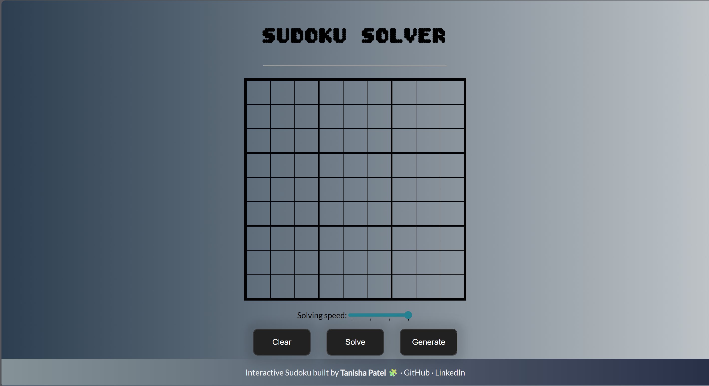
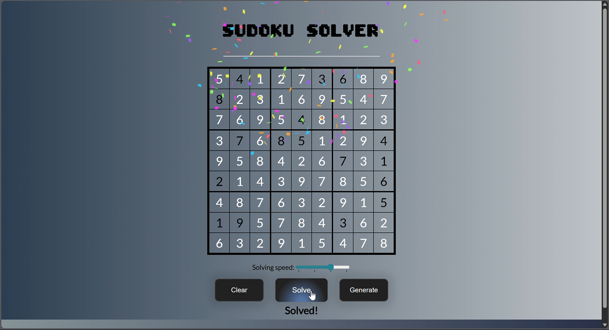
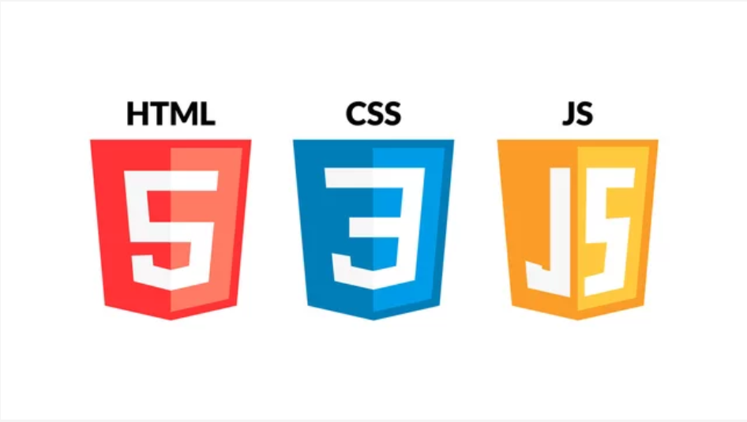

# 🧩 Sudoku Visualizer

<p align="center">
  
  
</p>

An interactive web application that visualizes the process of solving Sudoku puzzles using the backtracking algorithm.  
I built this project to strengthen my understanding of recursion and algorithmic problem-solving. Watching the solver progress cell by cell helped me grasp how backtracking operates in practice—how it makes decisions, handles constraints, and backtracks when it hits a dead end.

---

## ⚙️ Tech Stack Used

<p align="center">
  
</p>

- **HTML** – Structures the Sudoku grid and UI layout.
- **CSS** – Styles the grid, buttons, and animations.
- **JavaScript** – Implements the solver logic and user interaction.
- **Webpack** – Bundles and optimizes project files for deployment.

---

## ✨ Features

- Responsive 9x9 Sudoku grid generated dynamically with real-time visual feedback.
- Intuitive user interface built with HTML and CSS for a clean and accessible experience.
- Interactive keyboard-based input with live validation and error-prevention logic.
- Automated puzzle generation ensuring valid, solvable boards through randomized number placement and constraint checks.
- Step-by-step visualization of the backtracking algorithm with asynchronous execution and dynamic rendering.
- Configurable solving speed using adjustable delay intervals (e.g., slow, average, fast, instant) to observe algorithmic flow.
- Success-state detection triggering visual effects (confetti animation) upon correct puzzle completion.
- Full puzzle controls, including grid reset, solve-on-demand, and regeneration of new board states.
- Robust input validation preventing illegal number placement and maintaining puzzle consistency.

---

## ✅ Prerequisites

Before running the project locally, make sure the following are installed on your system:

- **Node.js** – JavaScript runtime environment
- **npm** – Node package manager used to install dependencies

---

## 📦 How to Clone and Run This Project

To run the project locally, follow these steps:

```bash
# 1. Clone the repository to your machine
git clone https://github.com/tanishapatel23/sudoku-visualizer.git

# 2. Move into the project directory
cd sudoku-visualizer

# 3. Install all project dependencies
npm install

# 4. Build the project using Webpack
npm run build

# 5. Open the application in your browser
# On Windows:
start dist/index.html
# On macOS:
open dist/index.html

# Or simply navigate to the dist folder and double-click index.html
```

---

## 🙌 Feedback

Feel free to open an issue or reach out via [LinkedIn](https://www.linkedin.com/in/tanisha-patel-77461a29a) if you have suggestions or ideas to improve this project.
